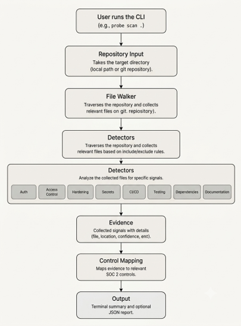

Probe

CLI tool that scans a local repository and collects code-level evidence for SOC 2 controls.

Probe checks authentication, access control, secrets, CI/CD, testing, dependencies, documentation, and application hardening.

Written in Go
CLI built with Cobra
Uses YAML for control configuration and detector mapping
Supports Go, JavaScript, TypeScript, Python, and Java
Static repository analysis only — no cloud accounts or network calls at scan time
Not an auditor and does not certify compliance
Complements cloud/SaaS evidence tools such as Osto's Evidence Collector
Why Probe?

Probe is designed to answer a simple question:

"What security-control evidence can be found in this repository?"

It scans the codebase, detects relevant signals, maps them to SOC 2 controls, and produces a terminal or JSON report.

Probe collects evidence that controls exist; it doesn't find vulnerabilities.

How Probe Works

The scanning flow is:

User → CLI → Repository Walker → Detectors → Evidence → SOC 2 Control Mapping → Terminal / JSON Report

Tech Stack
Go — core language
Cobra — CLI commands and argument handling
YAML — SOC 2 control configuration and mapping
Go YAML v3 — YAML parsing
Git — repository-aware checks
Supported Languages
Language	Supported
Go	Yes
JavaScript	Yes
TypeScript	Yes
Python	Yes
Java	Yes
Installation
go install github.com/bhumika019579/probe@latest

Requires Go 1.22+.

On Windows, make sure %USERPROFILE%\go\bin is in your PATH.

Build from Source
git clone https://github.com/bhumika019579/probe.git
cd probe
go install .
Commands
Scan current directory
probe scan .
Scan another local project
probe scan <path>
Generate JSON report
probe scan . --json report.json
View help
probe --help
probe scan --help

Probe scans the local directory you provide. It does not clone repositories or access GitHub during a scan.

What Each Control Checks
Control	Name	Checks
CC6.1	Logical Access Security	Authentication libraries and OAuth/JWT/session patterns
CC6.3	Access Authorization	Middleware and route-guard patterns
CC6.6	External Threat Protection	Input validation and application hardening signals
CC6.7	Secrets Protection	.env tracking and .env.example presence
CC8.1	Change Management	CI/CD configuration files
CC7.1	Automated Testing	Test file and naming conventions
CC7.2	Dependency Integrity	Dependency lockfiles
CC2.1	Documentation	SECURITY.md, README.md, CONTRIBUTING.md, LICENSE
Results

Probe reports each control as:

FOUND — recognizable evidence was detected
PARTIAL — some relevant evidence was detected
GAP — no recognizable evidence was detected
Confidence
High — directly detected or verified evidence
Medium — stronger code-level signal
Low — keyword or pattern-based signal

A GAP does not prove that a control is absent. It means Probe could not find recognizable evidence through its static analysis.

Out of Scope

Probe does not currently evaluate:

MFA enforcement
Live IAM / SSO configuration
AWS / GCP / Azure account settings
WAF / DDoS runtime protection
Backup / disaster recovery policies
Employee offboarding

These require information that cannot reliably be determined from static repository analysis.

Known Limitations
Hand-written authentication may not be detected if it does not match known patterns.
Low-confidence findings are signals, not proof of correct or runtime usage.
.env checks depend on Git repository information.
Generated and dependency directories are excluded from scanning.
Lockfile presence does not mean dependencies are vulnerability-free.
Probe does not scan for CVEs or execute tests.
SOC 2 mappings are simplified and do not represent full AICPA TSC compliance.
